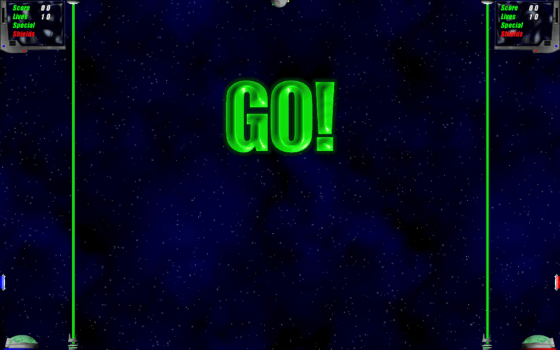

# Ascent

[](https://github.com/eduojeda/ascent/releases/latest)

**[Download Ascent](https://github.com/eduojeda/ascent/releases/latest)** for macOS (Apple silicon and Intel, macOS 11 or later) or Windows (64-bit, Windows 10 or later). Nothing else to install.

A two-player arena game originally written in 2002 for Classic Mac OS when I was a teenager. Catch the ball, throw it into your opponent's goal,
and use missiles, rockets, and powerups to make their day worse. This is the first sizable piece of software I ever wrote! Understandably the code is generally horrible, but I'm low key proud of a couple of things: I took the physics engine quite far, including friction and viscosity. And I somehow structured things in a sort of object oriented way without knowing OOP was even a thing.

It was built using [Ingemar Ragnemalm's Sprite Animation Toolkit](https://www.lysator.liu.se/~ingemar/sat/sat-downloads.html), a library underpinning many awesome games of the classic Mac shareware era (including Escape Velocity, one of my favorite games ever). It stopped receiving updates in 2009 and more or less fell off the face of the internet after that.

Over the years I looked into compiling the game for modern macOS purely for nostalgia value, but with SAT gone it would've required a pretty big rewrite I wasn't willing to undertake. By 2026 LLMs got good enough to finally make this feasible. Claude had little trouble reimplementing a subset of SAT using SDL and adjusting a few other bits here and there to make it run again on modern hardware. It's been quite a trip down memory lane.



## Download

Grab the zip for your system from the **[latest release](https://github.com/eduojeda/ascent/releases/latest)**.

**Windows:** unzip and run `Ascent.exe` from inside the `Ascent` folder. The
two SDL DLLs and the `assets` folder must stay next to it. The exe is not
code-signed, so SmartScreen may warn the first time: click **More info**,
then **Run anyway**.

**macOS:** unzip and put `Ascent.app` wherever you like. It is universal
(Apple silicon and Intel), runs on macOS 11 or later, and carries everything
it needs.

The app is signed but not notarized with Apple, so macOS refuses it the
first time:

- **macOS 15 and later:** open it once (it gets blocked), then go to
  System Settings → Privacy & Security and click **Open Anyway**.
- **macOS 11–14:** Control-click the app and choose **Open**.
- Or, from a terminal: `xattr -dr com.apple.quarantine Ascent.app`

Notarizing would remove this step, but needs a paid Apple developer
account.

## Controls

|                    | Left player (blue) | Right player (red) |
|--------------------|--------------------|--------------------|
| Move               | W A S D            | Arrow keys         |
| Shoot / release    | F                  | ,                  |
| Turn around        | G                  | .                  |
| Powerup            | H                  | /                  |

`P` pauses, `Esc` quits the match, `Cmd+Return` (macOS) or `Alt+Enter`
(Windows) toggles fullscreen. Keys are rebindable in Settings.

Launching with `--mute` silences a run without touching the Sound
setting, which is handy when rebuilding and testing repeatedly.

The play area defaults to the largest preset that fits your display
(800x600 minimum, the 2002 size) and can be changed in Settings.

Zoom (also in Settings, 130% by default) magnifies everything, since the
2002 sprites are a fixed number of pixels and look small on a big
screen. It shrinks the game's coordinate space rather than the picture:
the arena holds proportionally less space as you zoom in, but the frame
is still drawn at the full window resolution. It can only go as far as
leaves an 800x600 arena, which is what the HUD and menu layout need, so a
small window allows less zoom.

Settings and key bindings persist in
`~/Library/Application Support/Ascent/prefs.txt` on macOS and
`%APPDATA%\Ascent\prefs.txt` on Windows.

## Playing on your own

Tick **Red: computer** in Settings and the red ship plays itself, so the
blue keys are enough for a match. The computer player is in two halves.

A tactic says what to be doing for the next second or so: chase the loose
ball, run it at the goal, chase down whoever is carrying it, line up a
shot, fetch the powerup, fall back, or break away. Underneath it, code
running every frame flies the ship, holds the height a throw needs, and
picks the frame to let go on. That split exists because the game runs a
frame every 16ms and a ship crosses six pixels in that time, which is far
quicker than anything can be asked.

The tactic comes from [Jev](https://typesafe.ai), TypeSafe's System One
model, which answers a typed question about the game state in roughly
200ms rather than returning text. Set `TYPESAFE_API_KEY` and the game
asks it about six times a second on a background thread, sending the
positions, speeds, shields, scores and ball state as JSON and getting
back a tactic with a confidence, plus two yes/no probabilities for
whether to shoot and whether to spend the powerup. A tactic the model is
less than 35% sure of is ignored. At that rate a match costs well under a
penny.

With no key set, no network, or an answer that does not arrive, the same
tactics are chosen by a short scripted rule instead and the match plays
on identically. Worth saying plainly: the scripted version scores about
as often. The model is the interesting part, not the stronger part.

`ASCENT_JEV_MODEL` pins a model version, which is worth doing before
tuning anything, since the default alias changes answers over time.
`ASCENT_BOT_DEBUG=1` logs a line a second, and adding `ASCENT_BOT_TRACE=1`
logs every frame of a run at the goal.

The Windows build has no HTTP client compiled in, so the computer player
there always uses the scripted tactics.

## Build and run

```sh
brew install sdl3 sdl3_image pkgconf
make              # builds ./ascent (run it from the repo root)
make bundle       # builds Ascent.app
make dist         # zips it as Ascent-<version>-macOS.zip for a release
make windows      # cross-compiles build/windows/Ascent/ (Ascent.exe, DLLs, assets)
make dist-windows # zips it as Ascent-<version>-Windows.zip for a release
```

`make` is the quick local build: host architecture, linked against
Homebrew's SDL. The macOS targets also link libcurl, for the computer
player's calls to Jev; it ships with macOS, so there is nothing to
install.

`make bundle` builds the version to give to other people. It is universal
(Apple Silicon and Intel), targets macOS 11 and up, and carries SDL
inside it, so there is nothing to install on the other machine. The first
run downloads the official SDL3 frameworks into `third_party/`
(~50MB, cached and gitignored); `make frameworks` fetches them on their
own. Don't hand out a `make`-built binary — it is stamped with the build
machine's macOS version and links Homebrew paths, so other Macs refuse it
with "You can't use this version of the application with this version of
macOS". The app is signed ad-hoc, not notarized — see Download above
for what that means on first launch.

`make windows` cross-compiles the Windows build from macOS with
`brew install mingw-w64`. The first run downloads SDL's official MinGW
packages into `third_party/` (`make windows-sdl` fetches them on their
own). The result is a folder holding `Ascent.exe`, `SDL3.dll`,
`SDL3_image.dll` and `assets/`, which is what the zip contains; the exe
carries the 2002 icon and a version block from `src/ascent.rc`. It is
64-bit only and not code-signed.

The prebuilt `assets/` are checked in. To rebuild them from the original
art (`brew install netpbm`, plus a Python venv in `tools/.venv` with
pillow): `make assets`.

## About the port

The original was built with CodeWarrior against the Mac Toolbox
(QuickDraw, resource forks) and Ingemar Ragnemalm's Sprite Animation
Toolkit. The port keeps the 2002 game code — physics, gameplay, sprite
logic — intact and replaces the platform underneath:

- `src/compat/` reimplements the slice of the SAT API and QuickDraw the
  game uses, on SDL3. Dirty-rect animation became full-frame
  recomposition at the configured play-area size (the 2002 code already
  derived every position from the SAT screen-size globals, so larger
  arenas just work). Game coordinates are not screen pixels: zoom decides
  how many device pixels one game unit is worth, and the compat layer
  maps every coordinate and resamples sprite art once when it loads, so
  beams, HUD rules and stars are drawn at the display's own resolution
  rather than magnified afterwards. On play areas above 800x600 the
  starfield is scaled
  uniformly to cover and crisp single-pixel stars are re-scattered on top
  at the original density — tiling showed seams, stretching blurred the
  stars.
- `src/main.c` is new: SDL event loop, menu, settings, pause.
- `assets/sprites/hires/` holds higher-resolution copies of the sprites
  the engine reduces to whatever size the zoom asks for, instead of
  enlarging the 45x34 originals. They come from the 3D renders in
  `original/Development Stuff/`, which survive at around five times the sprite
  size — the 2002 build shrank them to fit Classic Mac.
  `tools/build_hires_sprites.py` fits each render onto the shipped
  sprite's silhouette so nothing shifts against its collision rectangle,
  works out which way round it goes by measuring rather than trusting the
  reconstruction pipeline's mirror flags, and refuses any animation whose
  silhouettes disagree — the bases, missiles, receivers, magnet and
  debris renders are not the art that shipped, so those keep their 2002
  sprites.
- The assets are the ORIGINALS, recovered from the 2002 release app's
  resource fork. The fork survived inside `original/Juego PPC.zip` — a Finder-made
  backup of the old dev machine whose `__MACOSX` AppleDouble entries
  carried it through years on a Windows disk. `tools/extract_rsrc.py`
  parses the fork (all 43 `snd ` sounds to WAV, 140 `cicn` sprite faces
  with their masks, all `PICT`s); `tools/install_original_assets.py`
  installs them into `assets/`.
- Before the archive turned up, the assets were reconstructed from the
  art sources in `original/Development Stuff/` (`tools/build_assets.py`) with
  synthesized placeholder sounds (`tools/gen-sounds.sh`); those tools
  remain as the fallback path — `make assets` runs the full chain,
  originals winning.

Two genuine 2002 bugs fixed, both nil dereferences that Classic Mac OS
silently allowed and modern macOS does not: `SetupBall` wrote through
`g.ball` before it was assigned, and the ships read `g.ball` when firing
or dying although the ball only exists once the spawner has dropped it —
a shot during the countdown crashed the game.

The untouched originals live in `original/`: the 2002 source in
`original/code/`, the art in `original/Development Stuff/`, the release
build and its read-me in `original/Ascent v1.0.1/`, and the archive that
carried the resource fork, `original/Juego PPC.zip` (which also holds the
CodeWarrior project and the SAT library the game was built with).

## License

MIT — see `LICENSE`. That covers the port, the 2002 source, and all the
art and sound, both the runtime `assets/` and the originals under
`original/`.

Two things in the repository are not mine and are not under that license:

- `original/code/mySAT.h`, and `SAT(PPC).lib`, `SATAdd-ons(68k).lib`,
  `SAT.h` and `SATAddOnLib.h` inside `original/Juego PPC.zip`, are
  Ingemar Ragnemalm's Sprite Animation Toolkit, kept as part of the
  historical record on his terms. The port does not use them:
  `src/compat/` reimplements the slice of the SAT API the game calls, and
  `src/mySAT.h` declares only that slice.
- The CodeWarrior project files in the archive are Metrowerks-generated
  project metadata.

`make bundle` and `make windows` download SDL3 and SDL3_image (zlib
license) and ship them inside `Ascent.app` and next to `Ascent.exe`; they
are not part of this repository.
