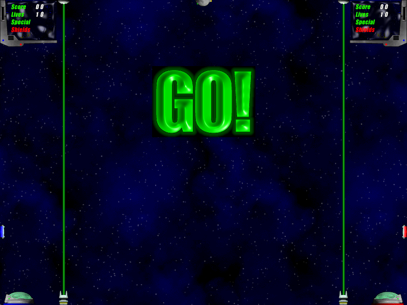

# Ascent

A two-player arena game written in 2002 for Classic Mac OS, ported to
modern macOS in 2026. Catch the ball, throw it into your opponent's goal,
and use missiles, rockets, and powerups to make their day worse.



## Build and run

```sh
brew install sdl3 sdl3_image pkgconf
make            # builds ./ascent (run it from the repo root)
make bundle     # builds Ascent.app
```

`make` is the quick local build: host architecture, linked against
Homebrew's SDL.

`make bundle` builds the version to give to other people. It is universal
(Apple Silicon and Intel), targets macOS 11 and up, and carries SDL
inside it, so there is nothing to install on the other machine. The first
run downloads the official SDL3 frameworks into `third_party/`
(~50MB, cached and gitignored); `make frameworks` fetches them on their
own. Don't hand out a `make`-built binary — it is stamped with the build
machine's macOS version and links Homebrew paths, so other Macs refuse it
with "You can't use this version of the application with this version of
macOS".

The app is signed ad-hoc, not notarized. Someone who downloads it will
have to right-click it and choose Open the first time (or run
`xattr -dr com.apple.quarantine Ascent.app`).

The prebuilt `assets/` are checked in. To rebuild them from the original
art (`brew install netpbm`, plus a Python venv in `tools/.venv` with
pillow): `make assets`.

## Controls

|                    | Left player (blue) | Right player (red) |
|--------------------|--------------------|--------------------|
| Move               | W A S D            | Arrow keys         |
| Shoot / release    | F                  | ,                  |
| Turn around        | G                  | .                  |
| Powerup            | H                  | /                  |

`P` pauses, `Esc` quits the match, `Cmd+Return` toggles fullscreen.
Keys are rebindable in Settings.

The play area defaults to the largest preset that fits your display
(800x600 minimum, the 2002 size) and can be changed in Settings.

Zoom (also in Settings, 130% by default) magnifies everything, since the
2002 sprites are a fixed number of pixels and look small on a big
screen. It shrinks the game's coordinate space rather than the picture:
the arena holds proportionally less space as you zoom in, but the frame
is still drawn at the full window resolution. It can only go as far as
leaves an 800x600 arena, which is what the HUD and menu layout need, so a
small window allows less zoom.

Settings and key bindings persist in
`~/Library/Application Support/Ascent/prefs.txt`.

## About the port

The original was built with CodeWarrior against the Mac Toolbox
(QuickDraw, resource forks) and Ingemar Ragnemalm's Sprite Animation
Toolkit. The port keeps the 2002 game code — physics, gameplay, sprite
logic — intact and replaces the platform underneath:

- `src/compat/` reimplements the slice of the SAT API and QuickDraw the
  game uses, on SDL3. Dirty-rect animation became full-frame
  recomposition at the configured play-area size (the 2002 code already
  derived every position from the SAT screen-size globals, so larger
  arenas just work). Game coordinates are not screen pixels: zoom decides
  how many device pixels one game unit is worth, and the compat layer
  maps every coordinate and resamples sprite art once when it loads, so
  beams, HUD rules and stars are drawn at the display's own resolution
  rather than magnified afterwards. On play areas above 800x600 the
  starfield is scaled
  uniformly to cover and crisp single-pixel stars are re-scattered on top
  at the original density — tiling showed seams, stretching blurred the
  stars.
- `src/main.c` is new: SDL event loop, menu, settings, pause.
- `assets/sprites/hires/` holds higher-resolution copies of the sprites
  the engine reduces to whatever size the zoom asks for, instead of
  enlarging the 45x34 originals. They come from the 3D renders in
  `original/Development Stuff/`, which survive at around five times the sprite
  size — the 2002 build shrank them to fit Classic Mac.
  `tools/build_hires_sprites.py` fits each render onto the shipped
  sprite's silhouette so nothing shifts against its collision rectangle,
  works out which way round it goes by measuring rather than trusting the
  reconstruction pipeline's mirror flags, and refuses any animation whose
  silhouettes disagree — the bases, missiles, receivers, magnet and
  debris renders are not the art that shipped, so those keep their 2002
  sprites.
- The assets are the ORIGINALS, recovered from the 2002 release app's
  resource fork. The fork survived inside `original/Juego PPC.zip` — a Finder-made
  backup of the old dev machine whose `__MACOSX` AppleDouble entries
  carried it through years on a Windows disk. `tools/extract_rsrc.py`
  parses the fork (all 43 `snd ` sounds to WAV, 140 `cicn` sprite faces
  with their masks, all `PICT`s); `tools/install_original_assets.py`
  installs them into `assets/`.
- Before the archive turned up, the assets were reconstructed from the
  art sources in `original/Development Stuff/` (`tools/build_assets.py`) with
  synthesized placeholder sounds (`tools/gen-sounds.sh`); those tools
  remain as the fallback path — `make assets` runs the full chain,
  originals winning.

One genuine 2002 bug fixed: `SetupBall` dereferenced `g.ball` before it
was assigned — Classic Mac OS silently allowed the nil write; modern
macOS does not.

The untouched originals live in `original/`: the 2002 source in
`original/code/`, the art in `original/Development Stuff/`, the release
build and its read-me in `original/Ascent v1.0.1/`, and the archive that
carried the resource fork, `original/Juego PPC.zip` (which also holds the
CodeWarrior project and the SAT library the game was built with).

## License

MIT — see `LICENSE`. That covers the port, the 2002 source, and all the
art and sound, both the runtime `assets/` and the originals under
`original/`.

Two things in the repository are not mine and are not under that license:

- `original/code/mySAT.h`, and `SAT(PPC).lib`, `SATAdd-ons(68k).lib`,
  `SAT.h` and `SATAddOnLib.h` inside `original/Juego PPC.zip`, are
  Ingemar Ragnemalm's Sprite Animation Toolkit, kept as part of the
  historical record on his terms. The port does not use them:
  `src/compat/` reimplements the slice of the SAT API the game calls, and
  `src/mySAT.h` declares only that slice.
- The CodeWarrior project files in the archive are Metrowerks-generated
  project metadata.

`make bundle` downloads SDL3 and SDL3_image (zlib license) and ships them
inside `Ascent.app`; they are not part of this repository.
